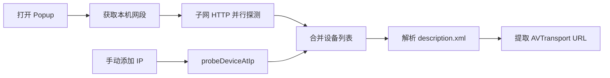

# SSDP / UDP 技术验证报告

## 结论

**Chrome Manifest V3 常规扩展无法使用 UDP 组播进行 SSDP 发现。**

| 方案 | MV3 扩展 | 说明 |
|------|----------|------|
| `chrome.sockets.udp` | 不可用 | 仅限已废弃的 Chrome Apps 平台 |
| 旧版 `socket` 权限 (`udp-multicast-membership`) | 不可用 | MV2 扩展曾可用，MV3 已移除 |
| Service Worker + `fetch` M-SEARCH | 不可用 | SSDP 基于 UDP，HTTP fetch 无法替代 |
| 子网 HTTP 探测 | **可用** | 扫描局域网 IP，请求 `/description.xml` 等 |
| 手动输入 IP | **可用** | 用户添加电视 IP，扩展拉取设备描述 |
| Native Messaging 伴侣 | 可用但未采用 | PRD 要求 extension-only |

## Mochi Cast 采用的发现策略

1. **主路径**：按优先级顺序扫描网段（上次电视 IP 网段 → 设置中的网段 → WebRTC/STUN → 常见网段）；**首个网段**使用与手动添加相同的端口探测（含 49152 等）；找到设备后停止，避免 12s 超时摊到 7 个错误网段。
2. **降级路径**：用户在 Popup 或设置中手动输入电视 IP。
3. **持久化**：手动添加的设备保存在 `chrome.storage.local`，下次自动探测。
4. **协议库预留**：`@mochi-cast/dlna-core` 已实现完整 SSDP M-SEARCH 解析与 `UdpTransport` 接口，若未来平台开放 UDP API 或增加 Native Messaging 伴侣，可直接接入。

## 性能与限制

- 子网扫描优先探测常见电视地址（如 `.100`、`.200`）；默认总超时 20s；**顺序**扫描网段（非并行），主网段开启全端口探测。
- 已发现设备会缓存，后续打开 Popup 可立即展示。
- 投屏控制（SOAP/HTTP）不受此限制，扩展可直接与局域网电视通信。

## 参考

- [chrome.sockets.udp](https://developer.chrome.com/docs/apps/reference/sockets/udp) — Chrome Apps only
- [vGet Cast](https://chrome.google.com/webstore/detail/vget-cast-dlna-controller/ekdjofnchpbfmnfbedalmbdlhbabiapi) — 旧版 MV2 + socket 权限
- Mozilla Connect: [DLNA streaming in Firefox](https://connect.mozilla.org/t5/ideas/media-streaming-of-video-content-in-firefox-window-to-a-dlna/idi-p/17556)
